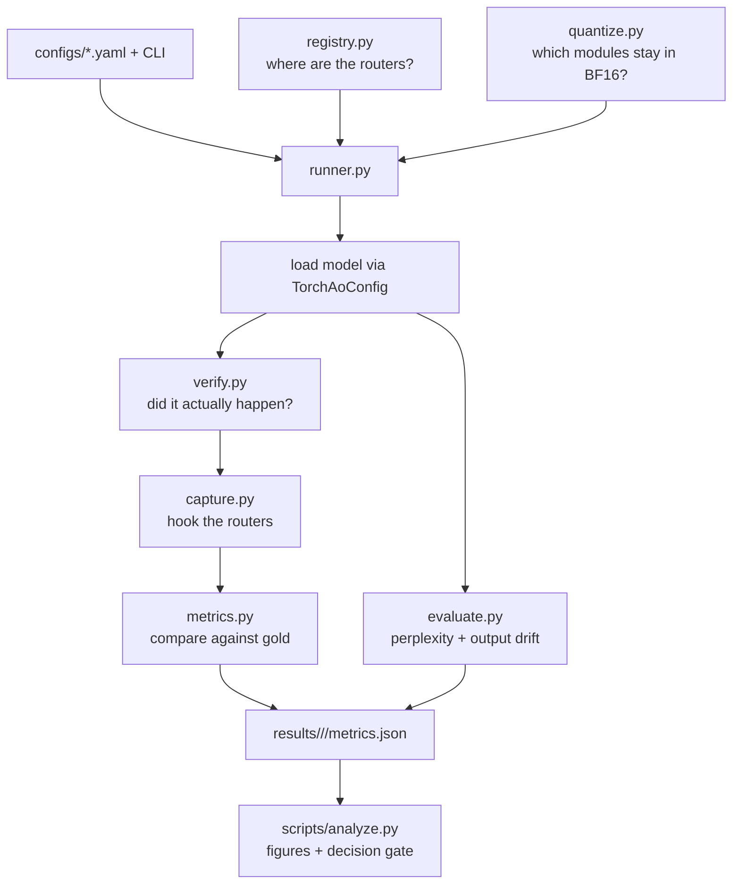

# Architecture

How the code is put together, and the reasoning behind the choices that are not obvious.

## Guiding constraint

Every failure mode in this project is **silent**. A quantizer that skips a module it does
not recognise still returns a working model with a plausible perplexity. A router hook
pointed at the wrong module still produces numbers. Nothing crashes; you simply publish
something false.

So the architecture is organised around one idea: *make the pipeline assert what it
actually did, not what it was asked to do.* That is why `verify.py` exists as a
first-class module rather than a test helper, and why every run writes an audit of the
tensors it modified into its results file.

## Data flow



The gold run is special: it writes the reference artifacts every later run is scored
against, and candidate runs refuse to start if they are missing. They are split across
three files by consumer — `artifacts.pt` (router logits, weights, sequence groups, token
fingerprint), `output_reference.pt` (compressed gold output distribution), and
`router_inputs.pt` (captured activations, needed only by the Part 2 attribution) — so a
candidate run does not load hundreds of megabytes it will never read.

Gold and candidate logits are compared row by row, and the only structural check in the
metric code is that the two tensors have the same shape. Any two runs with the same
sequence count and length satisfy that, so `artifacts.pt` also records a SHA-256
fingerprint of the exact token ids. A candidate whose corpus, seed, tokenizer, or
sequence layout differs is rejected rather than quietly compared against unrelated
tokens. `evaluate.py` applies the same idea to the output reference, refusing to finish
if it did not consume every gold scoring position.

## Modules

### `registry.py` — where the routers are

The one file that knows about specific architectures. A `ModelSpec` is declarative data:
a regex matching router modules, a list of gate-like patterns to protect, config attribute
names to read topology from, and a flag for whether the router's output *is* the logits.

Two details worth understanding:

**`router_pattern` vs `protect_patterns` are separate on purpose.** Qwen's
`shared_expert_gate` is gate-like, so `mixed` should keep it in high precision, but it is
a one-output sigmoid gate and not a router, so it must *not* be hooked for routing
metrics. Conflating them would pollute the KL.

**Topology is read from the model, then cross-checked against weight shapes.** Reading
`num_experts` from the config means a checkpoint revision cannot silently desync us;
asserting it equals the router's actual output dimension means a config typo cannot
either. `resolve_topology` raises if they disagree.

The regexes use **full-match** semantics, which is what makes `.*\.mlp\.gate` correctly
match `model.layers.0.mlp.gate` while rejecting both `...mlp.gate_proj` and
`...mlp.shared_expert_gate`. `tests/test_registry.py` enumerates every one of these
collisions explicitly, because getting it wrong is the difference between a real
experiment and a vacuous one.

### `quantize.py` — which modules stay in high precision

We do **not** implement quantization arithmetic. `torchao` provides selective per-module
quantization at 1–8 bits and `transformers` wires it in through `TorchAoConfig`. What
lives here is only *policy*.

A policy becomes an ordered dictionary that torchao resolves by precedence (exact
parameter name, exact module name, parameter regex, module regex, then `_default`):

```python
gold    = None                                        # nothing quantized
uniform = FqnToConfig({"_default": intx})             # everything, routers included
mixed   = FqnToConfig({r"re:.*\.mlp\.gate": None,     # routers skipped
                       "_default": intx})
```

Three design points:

- **`ALWAYS_SKIP` covers embeddings and `lm_head`** in every quantized policy. Standard
  PTQ practice, and including them would add a confound unrelated to routing.
- **`uniform` and `mixed` differ in exactly one respect.** `tests/test_quantize.py`
  asserts that the symmetric difference between their skip sets contains *only* router
  modules. This is what licenses attributing any measured difference to the router.
- **One config class for every bit-width.** We use `IntxWeightOnlyConfig` at 8, 4, and 3
  bits rather than the specialised `Int8WeightOnlyConfig` / `Int4WeightOnlyConfig`, so a
  trend across bit-widths reflects precision alone and not a change of kernel.

`sample_placebo_modules` builds the parameter-matched control by greedily accumulating
random non-router modules until within tolerance of the router budget, seeded for
reproducibility. A candidate that would carry the total past the upper bound is skipped
rather than added, since a later smaller module may still land the set in range.

### `verify.py` — did it actually happen?

Runs after every load, before anything expensive is computed.

**Structural check.** torchao replaces quantized weights with a tensor subclass, so
`weight_kind()` reporting `"Tensor"` means untouched. From that we assert:

| Policy | Assertion |
|--------|-----------|
| `gold` | nothing is quantized |
| any quantized | *something* was quantized (catches `_default` matching nothing) |
| `mixed` | **no** router is quantized |
| `uniform`, `placebo`, `attention` | **all** routers are quantized |
| all | no module the policy protects was quantized anyway |

The router assertions are the ones that matter most. Without them a silently-skipped
router makes `uniform` identical to `mixed`, and the whole comparison is vacuous while
still producing a full results table. The same applies to `placebo`: its entire purpose
is to protect a random parameter-matched set *instead of* the routers, so a placebo that
accidentally spared a router would be a second `mixed` run under a different name, and
would appear to confirm whatever `mixed` showed.

**Bit-width check.** Independent of torchao's own bookkeeping. Under per-axis integer
quantization each output channel is `scale * q` for integer `q`, so an N-bit weight can
show at most `2**N` distinct values per row. `effective_levels()` counts them. A row with
thousands of distinct values was never quantized, whatever the config claimed. The sampled
modules are spread across the depth of the model rather than taken from the front, which
would only ever inspect layer 0.

### `capture.py` — hooking the routers

A context manager registering two hooks per router:

- a **forward hook** recording logits, which drive every Part 1 metric;
- a **forward pre-hook** recording the input activations, which Part 1 never uses but
  Part 2 needs. Capturing them now costs one hook and turns Part 2 into offline analysis
  instead of a second round of cluster jobs.

Activations are large, so they are strided (`input_stride`, default every 8th token) and
stored as fp16 on CPU. Logits are small and kept in full.

The pre-hook also handles the DeepSeek case: when `router_output_kind == "recompute"`, the
module's output carries no logits, so the forward hook rebuilds them as `input @ W.T` from
the stashed activation.

**Batches are single-sequence on purpose.** With no padding there are no masked positions
to track, and since gold and candidate runs see identical tokens in identical order,
captured rows line up by construction. `tests/test_capture_and_data.py` asserts that
alignment holds across two different models.

### `metrics.py` — comparing routers

Takes `[num_tokens, num_experts]` logits from gold and candidate on identical positions.

Three choices worth explaining:

- **Full-softmax KL and effective routing weights are reported separately.** The full
  softmax is dominated by the long tail of experts that are never selected, so it can move
  a lot while the actual computation path is unchanged. `effective_weights()` gives the
  post-top-*k*, renormalised, zero-elsewhere vector that really multiplies expert outputs.
- **Jensen-Shannon alongside KL**, because KL is unbounded and explodes when the candidate
  puts near-zero mass where gold had some.
- **Bootstrap confidence intervals resample whole sequences, not tokens.** Tokens within a
  sequence are correlated, so token-level resampling gives dishonestly tight intervals.
  `tests/test_metrics.py` constructs data with strong between-sequence and negligible
  within-sequence variation and asserts the grouped interval comes out wider.

Expert load is reported as marginal usage entropy, *per-token* routing entropy (the
marginal alone conflates load imbalance with router confidence), dead-expert count, and
max-over-mean load ratio.

### `data.py` and `evaluate.py`

`data.py` is pure functions of (corpus, tokenizer, seed) with no run-to-run state, which
is what guarantees alignment. `routing_batches` returns both the batches and a `groups`
array giving the sequence id of every token position, which is what the bootstrap needs.

`evaluate.py` computes perplexity by sliding window, masking overlap out of the loss when
stride is smaller than the window so no token is scored twice.

It also computes **output drift**, because perplexity is blunt — INT8 barely moves it, and
a model can shift its output distribution noticeably while perplexity stays flat. Storing
full-vocabulary distributions is not viable, so the gold run saves only its top-M token
ids and log-probabilities at a strided subset of positions. Candidates gather those same
token ids, both sides are renormalised over that shared support, and we report a truncated
KL plus top-1 agreement.

### `runner.py` and `config.py`

`runner.py` executes one (model, policy, bit-width) combination. `config.py` holds the
dataclass, YAML loading, and `environment()`, which records torch/transformers/torchao
versions, GPU name and compute capability, and the git commit into every results file.

The gold run additionally performs a **self-comparison** — comparing its own captured
logits against themselves — which must give exactly zero KL and zero top-1 error. If it
does not, something upstream is nondeterministic and no other number can be trusted.

## Testing

136 tests, no GPU and no downloads, running in about six seconds.

`tests/conftest.py` builds a synthetic MoE deliberately shaped like the real ones:
`model.layers.{i}.mlp.gate` for the router, `mlp.experts.{j}.gate_proj` inside experts,
and an optional `mlp.shared_expert_gate`. Those names exist to catch pattern-matching
mistakes that would otherwise only appear on a real checkpoint.

`tests/test_verify.py` uses a `FakeQuantized` tensor subclass to simulate what torchao
does to a weight, so the audit logic is tested without needing torchao installed.

`tests/test_integration.py` runs the whole data path — capture, comparison, JSON
serialisation, plotting, and the decision gate — on two synthetic models. It is also where
the Part 2 premise shows up: a `mixed` model with bit-identical router weights still has
non-zero routing drift, because its activations arrived through quantized layers.

## Layout

```text
src/moequant/
├── registry.py     where routers are, per architecture
├── quantize.py     which modules stay in BF16 (torchao FqnToConfig policies)
├── verify.py       did the quantization do what we asked?
├── capture.py      forward hooks: router logits and inputs
├── metrics.py      KL, JS, top-k mismatch, entropy, bootstrap CIs
├── data.py         WikiText-2, seeded routing subsets, PPL windows
├── evaluate.py     perplexity + output-distribution drift
├── config.py       experiment config and environment capture
└── runner.py       one (model, policy, bits) run, end to end

scripts/
├── inspect_model.py   architecture discovery (meta device, no GPU)
├── run.py             sweep driver
├── analyze.py         figures, tables, decision gate
└── slurm/             cluster job scripts

tests/              136 tests, CPU only, ~6s
configs/            olmoe.yaml, qwen.yaml
```

## Deliberate non-goals in Part 1

- **No real memory savings measured.** torchao does quantize for real, but we run on GPUs
  where the dequantized compute path dominates, and we are measuring quality, not
  throughput.
- **No calibration-based PTQ** (GPTQ, AWQ). The research question is specifically about a
  *calibration-free* structural safeguard. Those belong in related work.
- **`decompose.py` is not written yet.** It is Part 2, and it only gets built if the
  decision gate says Part 1 came out null. The activations it needs are already being
  captured.
