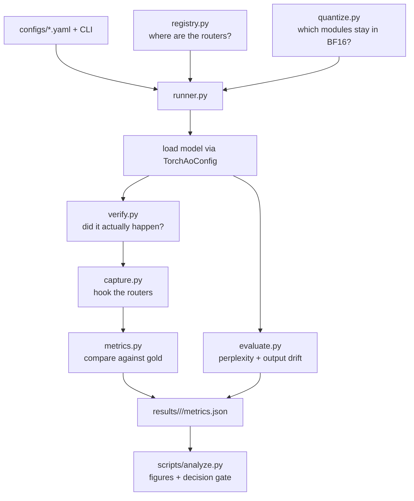

# Architecture

How the code is put together, and the reasoning behind the choices that are not obvious.

## Guiding constraint

Every failure mode in this project is **silent**. A quantizer that skips a module it does
not recognise still returns a working model with a plausible perplexity. A router hook
pointed at the wrong module still produces numbers. Nothing crashes; you simply publish
something false.

So the architecture is organised around one idea: *make the pipeline assert what it
actually did, not what it was asked to do.* That is why `verify.py` exists as a
first-class module rather than a test helper, and why every run writes an audit of the
tensors it modified into its results file.

## Data flow


```mermaid
flowchart TD
    cfg["configs/*.yaml + CLI"] --> runner
    registry["registry.py<br/>where are the routers?"] --> runner
    quantize["quantize.py<br/>which modules stay in BF16?"] --> runner
    runner["runner.py"] --> load["load model via TorchAoConfig"]
    load --> verify["verify.py<br/>did it actually happen?"]
    verify --> capture["capture.py<br/>hook the routers"]
    capture --> metrics["metrics.py<br/>compare against gold"]
    load --> evaluate["evaluate.py<br/>perplexity + output drift"]
    metrics --> json["results/<model>/<run>/metrics.json"]
    evaluate --> json
    json --> analyze["scripts/analyze.py<br/>figures + decision gate"]
```

The gold run is special: it writes the reference artifacts every later run is scored
against, and candidate runs refuse to start if they are missing. They are split across
three files by consumer — `artifacts.pt` (router logits, weights, sequence groups, token
fingerprint), `output_reference.pt` (compressed gold output distribution), and
`router_inputs.pt` (captured activations, needed only by the Part 2 attribution) — so a
candidate run does not load hundreds of megabytes it will never read.

Gold and candidate logits are compared row by row, and the only structural check in the
metric code is that the two tensors have the same shape. Any two runs with the same
sequence count and length satisfy that, so `artifacts.pt` also records a SHA-256
fingerprint of the exact token ids. A candidate whose corpus, seed, tokenizer, or
sequence layout differs is rejected rather than quietly compared against unrelated
tokens. `evaluate.py` applies the same idea to the output reference, refusing to finish
if it did not consume every gold scoring position.

## Modules

### `registry.py` — where the routers are

The one file that knows about specific architectures. A `ModelSpec` is declarative data:
a regex matching router modules, a list of gate-like patterns to protect, config attribute
names to read topology from, and a flag for whether the router's output *is* the logits.

Two details worth understanding:

**`router_pattern` vs `protect_patterns` are separate on purpose**, even though every
current spec sets them to the same regex. Qwen's `shared_expert_gate` is the reason they
were split: it is gate-like, and an early version of the spec protected it. That was a
mistake. It emits one scalar weighting the shared expert's contribution rather than
choosing among experts, so protecting it made `mixed` mean something broader on Qwen than
on OLMoE, which has no shared expert at all. Every spec now protects routers only, and
`test_real_specs_are_wellformed` enforces it. Leaving the shared gate quantized also makes
Qwen the conservative test: whatever distortion it picks up counts against `mixed`.

The two fields stay distinct because a future architecture may genuinely need to protect a
non-router module, and because the shared gate must *not* be hooked for routing metrics
regardless of how it is quantized — hooking it would pollute the KL.

**Topology is read from the model, then cross-checked against weight shapes.** Reading
`num_experts` from the config means a checkpoint revision cannot silently desync us;
asserting it equals the router's actual output dimension means a config typo cannot
either. `resolve_topology` raises if they disagree.

The regexes use **full-match** semantics, which is what makes `.*\.mlp\.gate` correctly
match `model.layers.0.mlp.gate` while rejecting both `...mlp.gate_proj` and
`...mlp.shared_expert_gate`. `tests/test_registry.py` enumerates every one of these
collisions explicitly, because getting it wrong is the difference between a real
experiment and a vacuous one.

### `quantize.py` — which modules stay in high precision

We do **not** implement quantization arithmetic. `torchao` provides selective per-module
quantization at 1–8 bits and `transformers` wires it in through `TorchAoConfig`. What
lives here is only *policy*.

A policy becomes an ordered dictionary that torchao resolves by precedence (exact
parameter name, exact module name, parameter regex, module regex, then `_default`):

```python
gold    = None                                        # nothing quantized
uniform = FqnToConfig({"_default": intx})             # everything, routers included
mixed   = FqnToConfig({r"re:.*\.mlp\.gate": None,     # routers skipped
                       "_default": intx})
```

Three design points:

- **`ALWAYS_SKIP` covers embeddings and `lm_head`** in every quantized policy. Standard
  PTQ practice, and including them would add a confound unrelated to routing.
- **`uniform` and `mixed` differ in exactly one respect.** `tests/test_quantize.py`
  asserts that the symmetric difference between their skip sets contains *only* router
  modules. This is what licenses attributing any measured difference to the router.
- **One config class for every bit-width.** We use `IntxWeightOnlyConfig` at 8, 4, and 3
  bits rather than the specialised `Int8WeightOnlyConfig` / `Int4WeightOnlyConfig`, so a
  trend across bit-widths reflects precision alone and not a change of kernel.

`sample_placebo_modules` builds the parameter-count-matched control. It sets the budget to
the total router parameter count across *all* layers, filters the candidate pool to modules
no larger than that whole budget, shuffles with `random.Random(placebo_seed)`, then
accumulates until within `tolerance` of the budget.

**On both real checkpoints that loop terminates after a single draw**, so the greedy
accumulation and the tolerance band are never exercised. The arithmetic makes the first
pick sufficient on its own:

| Model | Protected module (`placebo_seed=0`) | Params | Ratio to router budget | Candidate pool |
|-------|-------------------------------------|--------|------------------------|----------------|
| OLMoE-1B-7B | `model.layers.14.mlp.experts.10.down_proj` | 2,097,152 | **1.000000×** | 3,072 modules, all this size |
| Qwen1.5-MoE-A2.7B | `model.layers.19.mlp.experts.45.down_proj` | 2,883,584 | **0.977778×** | 4,320 of this size plus 24 × 2,048 |

On OLMoE every eligible candidate is an expert projection of `2048 × 1024` params, which is
*exactly* the whole 16-layer router budget; the attention projections are twice that and
the `n <= budget` pool filter excludes them. On Qwen the expert projections are
`2048 × 1408` = 0.978× the budget. Either way one draw lands in tolerance immediately. The
selection is deterministic given `placebo_seed`, and `scripts/verify_offline.py` re-derives
it from a meta-device skeleton and writes it into `results/<model>/verification.md`, because
the FQNs are not recorded in any `metrics.json` — only `num_protected_modules`.

**The control is matched on parameter count and on nothing else, and the mismatch that
matters is activation exposure.** A router is read by every token in every layer. Measured
from the gold router logits, the protected expert projection is on the compute path for
**11.43%** of the 32,768 routing tokens on OLMoE (top-8 of 64) and **5.04%** on Qwen
(top-4 of 60), in one layer only. Counting token×layer forward events, the routers are
exposed 16 / 0.1143 ≈ **140×** more on OLMoE and 24 / 0.0504 ≈ **477×** more on Qwen.

So the placebo rules out *"any high-precision parameters help"* — it lands on `uniform` to
six decimal places on both models — and structurally cannot address *"any high-precision
island on the every-token, every-layer main path helps"*. The `attention` policy is the run
with the matching exposure profile, and it has since been executed at all three bit-widths
on both models. It recovers only part of `mixed`'s routing-KL reduction at INT4 and INT3,
and more than all of it at INT8 — which is the attribution result of `attribution.py`
showing up as a policy, since at INT8 the incoming activations are the larger source.

### `verify.py` — did it actually happen?

Runs after every load, before anything expensive is computed.

**Structural check.** torchao replaces quantized weights with a tensor subclass, so
`weight_kind()` reporting `"Tensor"` means untouched. From that we assert:

| Policy | Assertion |
|--------|-----------|
| `gold` | nothing is quantized |
| any quantized | *something* was quantized (catches `_default` matching nothing) |
| `mixed` | **no** router is quantized |
| `uniform`, `placebo`, `attention` | **all** routers are quantized |
| all | no module the policy protects was quantized anyway |

The router assertions are the ones that matter most. Without them a silently-skipped
router makes `uniform` identical to `mixed`, and the whole comparison is vacuous while
still producing a full results table. The same applies to `placebo`: its entire purpose
is to protect a random parameter-matched set *instead of* the routers, so a placebo that
accidentally spared a router would be a second `mixed` run under a different name, and
would appear to confirm whatever `mixed` showed.

**Bit-width check.** Independent of torchao's own bookkeeping. Under per-axis integer
quantization each output channel is `scale * q` for integer `q`, so an N-bit weight can
show at most `2**N` distinct values per row. `effective_levels()` counts them. A row with
thousands of distinct values was never quantized, whatever the config claimed.

The sample is drawn **per role** — router, expert projection, attention, other — with at
least one module from each role present in the quantized pool. It used to be drawn by
striding the candidate list, on the reasoning that this spreads the sample across depth.
It does not: the number of quantizable modules per layer happens to divide the stride on
both checkpoints (197 per layer on OLMoE with `3152 // 4 = 4 × 197`; 189 on Qwen with
`4536 // 4 = 6 × 189`), so every pick landed on `self_attn.q_proj` and the check never
inspected a router or an expert on the `uniform` and `mixed` runs. The precision claim was
being made about four attention projections. Role-based sampling cannot fail that way
whatever the module layout, and `check_bit_width` now also reports which roles it covered
and refuses to pass vacuously when a role it expected is absent from the pool.

The in-pipeline check still inspects at most 8 rows of each sampled module, which is a
smoke test. `scripts/verify_offline.py` is the strong version: it reads the router weights
saved in every run's artifacts and counts distinct values in **every output channel of
every router in every layer of every run**, with no GPU. That is what
`results/<model>/verification.md` records. The paper makes the bit-identity claim in
Section 4 and, for length, does not reproduce the table, so this file is the evidence
behind it.

### `capture.py` — hooking the routers

A context manager registering two hooks per router:

- a **forward hook** recording logits, which drive every Part 1 metric;
- a **forward pre-hook** recording the input activations, which Part 1 never uses but
  Part 2 needs. Capturing them now costs one hook and turns Part 2 into offline analysis
  instead of a second round of cluster jobs.

Activations are large, so they are strided (`input_stride`, default every 8th token) and
stored as fp16 on CPU. Logits are small and kept in full.

The pre-hook also handles the DeepSeek case: when `router_output_kind == "recompute"`, the
module's output carries no logits, so the forward hook rebuilds them as `input @ W.T` from
the stashed activation.

**Batches are single-sequence on purpose.** With no padding there are no masked positions
to track, and since gold and candidate runs see identical tokens in identical order,
captured rows line up by construction. `tests/test_capture_and_data.py` asserts that
alignment holds across two different models.

### `metrics.py` — comparing routers

Takes `[num_tokens, num_experts]` logits from gold and candidate on identical positions.

Three choices worth explaining:

- **Full-softmax KL and effective routing weights are reported separately.** The full
  softmax is dominated by the long tail of experts that are never selected, so it can move
  a lot while the actual computation path is unchanged. `effective_weights()` gives the
  post-top-*k*, renormalised, zero-elsewhere vector that really multiplies expert outputs.
- **Jensen-Shannon alongside KL**, because KL is unbounded and explodes when the candidate
  puts near-zero mass where gold had some.
- **Bootstrap confidence intervals resample whole sequences, not tokens.** Tokens within a
  sequence are correlated, so token-level resampling gives dishonestly tight intervals.
  `tests/test_metrics.py` constructs data with strong between-sequence and negligible
  within-sequence variation and asserts the grouped interval comes out wider.

Expert load is reported as marginal usage entropy, *per-token* routing entropy (the
marginal alone conflates load imbalance with router confidence), dead-expert count, and
max-over-mean load ratio.

`compare_routing` reports these both per layer and pooled, and **the pooled figure is the
wrong one for expert collapse**: it concatenates tokens across layers into one histogram
before measuring, so expert *j* in layer 0 and expert *j* in layer 12 land in the same bin
and imbalances in opposite directions cancel. See `collapse.py`.

`paired_bootstrap_ci` is for comparing two policies rather than a policy against gold.
The Part 1 decision gate asks whether two separately-built intervals overlap, which
discards a pairing that is present in the data: both arms are measured on the same tokens
and bootstrapped with the same seed over the same sequence groups, so the replicates are
the same resamples. Differencing inside each replicate cancels the sequence-level variation
the two arms share. The overlap test is the conservative version, not the wrong answer, so
it stays as the headline and the paired result is reported alongside in
`results/*/paired_bootstrap.md`.

### `collapse.py` — per-layer expert balance

Two tiers at deliberately different token resolutions, because each field is only
trustworthy at one of them. **Tier 1** reads `routing.per_layer.<L>.cand_usage` out of a
run's `metrics.json`: those fields were computed on all 32,768 routing tokens, which is the
only resolution at which a zero selection count means an expert really received nothing, so
dead and unused counts come from there. **Tier 2** rebuilds per-expert counts from the gold
`artifacts.pt` and each run's `router_inputs.pt` — the runs never stored counts as such —
to get Gini, max expert share, top-decile load share and KL of the load against uniform.
Those inputs were captured every 8th token, which is ample for ratio statistics and
inflates zero counts, so Tier 2 never reports dead or unused experts.

Normalized entropy is kept for continuity with the existing tables but it is the wrong
shape for the job: uniform load is its *maximum*, so its gradient is zero exactly where the
null hypothesis sits. On Qwen at INT3 the pooled entropy fell 0.9996 → 0.9929, which reads
as a null, while per layer it falls to 0.7585 with 15.4% of expert slots starved. Gini and
KL against uniform have no such ceiling and separate the same runs by 2.1×.

### `attribution.py` — Part 2, offline

The four-cell decomposition. Because `capture.py` already recorded each router's input
activations and each run stored the dequantized router weights it used, all four
combinations of gold/quantized weights and activations are one `F.linear` each on the CPU —
no second sweep and no GPU. `check_reconstruction` is the gate: cell A must reproduce the
routing decisions the gold run recorded, and below 95% top-1 agreement the decomposition is
measuring something other than quantization. It achieves 99.66% (OLMoE) and 99.37% (Qwen),
which is also the noise floor every cell inherits from fp16-stored activations recomputed
in CPU fp32 against a bf16 GPU forward pass.

Cell C uses the `mixed` run's activations, which is what makes it exactly the `mixed`
condition — and what makes cell D *not* the `uniform` run, since it omits the feedback of
changed routing on later layers' hidden states. Both facts are load-bearing and both are
stated in the module docstring, because mislabelling D as `uniform` would turn a small
extra result into an apparent inconsistency.

### `data.py` and `evaluate.py`

`data.py` is pure functions of (corpus, tokenizer, seed) with no run-to-run state, which
is what guarantees alignment. Two corpora are registered, WikiText-2 test and one shard of
the C4 English validation split; the `_c4` configs differ from their WikiText-2 siblings in
the corpus and the results directory and in nothing else, so a difference between the two
sweeps is a corpus effect rather than a protocol change. Run directories are keyed by model
and policy with no corpus component, so `runner._check_results_corpus` refuses to start a
C4 run that would overwrite a WikiText-2 tree. `routing_batches` returns both the batches and a `groups`
array giving the sequence id of every token position, which is what the bootstrap needs.

`evaluate.py` computes perplexity by sliding window, masking overlap out of the loss when
stride is smaller than the window so no token is scored twice.

It also computes **output drift**, because perplexity is blunt — INT8 barely moves it, and
a model can shift its output distribution noticeably while perplexity stays flat. Storing
full-vocabulary distributions is not viable, so the gold run saves only its top-M token
ids and log-probabilities at a strided subset of positions. Candidates gather those same
token ids, both sides are renormalised over that shared support, and we report a truncated
KL plus top-1 agreement.

### `runner.py` and `config.py`

`runner.py` executes one (model, policy, bit-width) combination. `config.py` holds the
dataclass, YAML loading, and `environment()`, which records torch/transformers/torchao
versions, GPU name and compute capability, and the git commit into every results file.

The gold run additionally performs a **self-comparison** — comparing its own captured
logits against themselves — which must give exactly zero KL and zero top-1 error. If it
does not, something upstream is nondeterministic and no other number can be trusted.

## Testing

188 tests, no GPU and no downloads, running in about twelve seconds.

`tests/conftest.py` builds a synthetic MoE deliberately shaped like the real ones:
`model.layers.{i}.mlp.gate` for the router, `mlp.experts.{j}.gate_proj` inside experts,
and an optional `mlp.shared_expert_gate`. Those names exist to catch pattern-matching
mistakes that would otherwise only appear on a real checkpoint.

`tests/test_verify.py` uses a `FakeQuantized` tensor subclass to simulate what torchao
does to a weight, so the audit logic is tested without needing torchao installed.

`tests/test_integration.py` runs the whole data path — capture, comparison, JSON
serialisation, plotting, and the decision gate — on two synthetic models. It is also where
the Part 2 premise shows up: a `mixed` model with bit-identical router weights still has
non-zero routing drift, because its activations arrived through quantized layers.

## Layout

```text
src/moequant/
├── registry.py     where routers are, per architecture
├── quantize.py     which modules stay in BF16 (torchao FqnToConfig policies)
├── verify.py       did the quantization do what we asked?
├── capture.py      forward hooks: router logits and inputs
├── metrics.py      KL, JS, top-k mismatch, entropy, bootstrap CIs (paired and marginal)
├── collapse.py     per-layer expert-load balance, Gini / shares / KL vs uniform
├── attribution.py  Part 2 four-cell decomposition (offline, no GPU)
├── data.py         WikiText-2 and C4, seeded routing subsets, PPL windows
├── evaluate.py     perplexity + output-distribution drift
├── config.py       experiment config and environment capture
└── runner.py       one (model, policy, bits) run, end to end

scripts/
├── inspect_model.py     architecture discovery (meta device, no GPU)
├── run.py               sweep driver
├── analyze.py           figures, tables, decision gate
├── attribute.py         Part 2 attribution report
├── collapse.py          per-layer expert-collapse tables
├── paired_bootstrap.py  paired-difference test on mixed - uniform
├── verify_offline.py     router bit-identity and level counts, placebo derivation
└── slurm/               cluster job scripts

tests/              188 tests, CPU only, ~12s
configs/            olmoe.yaml, qwen.yaml, olmoe_c4.yaml, qwen_c4.yaml
```

Everything under `scripts/` except `run.py` is CPU-only and reads artifacts already on
disk, so the whole analysis side of the project reruns without touching the cluster.

## Deliberate non-goals in Part 1

- **No real memory savings measured.** torchao does quantize for real, but we run on GPUs
  where the dequantized compute path dominates, and we are measuring quality, not
  throughput.
- **No calibration-based PTQ** (GPTQ, AWQ). The research question is specifically about a
  *calibration-free* structural safeguard. Those belong in related work.
- **No per-window perplexity interval.** `evaluate_lm` accumulates a scalar `total_nll`, so
  perplexity is a point estimate over all scored tokens with no interval recoverable
  offline. The decision gate deliberately excludes it and rests on the routing metrics,
  which do carry sequence-level bootstrap intervals.
