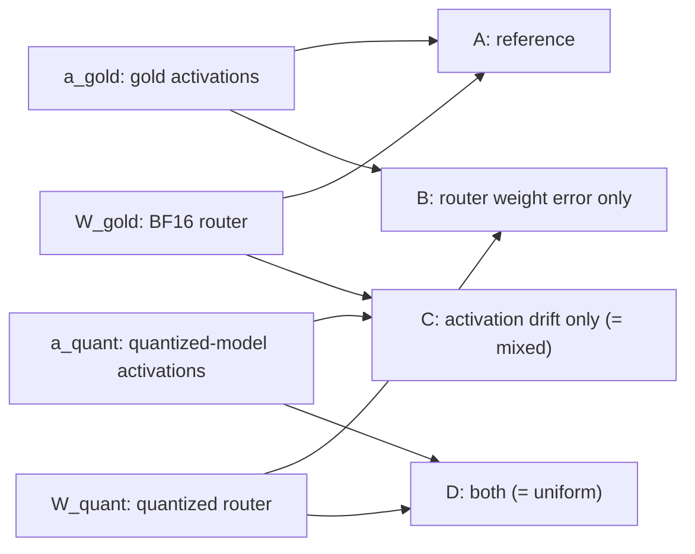

# Optimal Quantization in MoE: Router Protection, and Why It Does or Does Not Work

## The idea in plain words

An MoE model works like a hospital. Every patient (token) first sees a **receptionist** (the router, also called the gate), who glances at them and sends them to a handful of **specialists** (the experts) out of dozens available. Only those few specialists do any work, which is what makes MoE models cheap to run.

**Quantization** is compressing everyone's notes to save filing space: instead of writing numbers with full precision, you round them off. Do it to the specialists and you save enormous space, because they are almost the entire hospital. But if you also round off the receptionist's notes, she may start sending patients to the wrong specialists, and a wrong referral is much worse than slightly sloppy notes.

**Our proposal:** the receptionist is one person out of thousands of staff. Keeping her notes at full precision costs essentially nothing. So compress every specialist, leave the receptionist alone, and see whether the hospital keeps working. That is Part 1, and it is exactly what we told the lecturer we would do.

**The catch we need to be ready for:** even a perfect receptionist can misroute if the *patient chart arriving at her desk* was already garbled by compressed departments upstream. If that turns out to be the dominant problem, protecting the receptionist will not help much. Part 2 measures precisely how much of the damage comes from her own notes versus from the garbled charts.

Either outcome is a real result. If Part 1 works, we have shown a free fix that the literature has been solving with expensive calibration. If it does not, Part 2 explains why, which is a genuine contribution because two recent papers assert this without quantifying it.

## What we are actually building

Six pieces, none of them exotic:

1. **A compression policy** (`quantize.py`). We do *not* write quantization math. PyTorch's `torchao` library has `FqnToConfig`, which takes a dictionary mapping module names (or regexes) to a quantization config, where `None` means "leave this one alone." Our entire experimental matrix becomes a few dictionaries, loaded through `transformers`' `TorchAoConfig`. Bit-widths 1 through 8 come free via `IntxWeightOnlyConfig`.
2. **A model map** (`registry.py`). Every MoE model organises its routers differently. One small file per architecture records where the routers live, how many experts there are, and how many get picked per token.
3. **Spies** (`capture.py`). Small hooks that sit on each router and record what went in and what came out, without changing anything.
4. **A measuring tape** (`metrics.py`). Compares the router's decisions in the original model against the compressed one: how different are the probabilities, how often does it pick a different set of experts, does it start overusing a few popular ones.
5. **A scoreboard** (`runner.py`, `analyze.py`). Runs a configuration end to end, saves every number to a JSON file, and turns those into plots and tables for the paper.
6. **Correctness gates** (`verify.py`, `tests/`). Checks that catch the silent failures described below, before we trust any number.

### How the three configs are expressed

The whole Part 1 matrix is a handful of dictionaries. This is the payoff of using the right library:

```python
from torchao.quantization import FqnToConfig, IntxWeightOnlyConfig
from transformers import TorchAoConfig

intx = IntxWeightOnlyConfig(weight_dtype=torch.int4)   # or int8 / int3

gold    = None                                          # nothing quantized
uniform = FqnToConfig({"_default": intx})               # everything, routers included
mixed   = FqnToConfig({r"re:.*\.mlp\.gate$": None,      # routers skipped
                       "_default": intx})
placebo = FqnToConfig({**random_param_matched_skips,    # a random 0.02% skipped instead
                       "_default": intx})

model = AutoModelForCausalLM.from_pretrained(
    model_id, quantization_config=TorchAoConfig(quant_type=cfg))
```

`FqnToConfig` resolves keys by precedence: exact parameter name, exact module name, parameter regex, module regex, then `_default`. That is precisely the targeting we need, and unlike bitsandbytes it is not restricted to what a `nn.Linear` walker happens to find.

## Part 1: the question we promised

**RQ.** Does keeping only the router in BF16, while quantizing all expert weights, reduce routing drift and perplexity loss relative to uniform quantization, with no calibration?

Three configurations per model, per bit-width:

- **gold** — everything in BF16 (upper bound)
- **uniform** — everything quantized, routers included (negative baseline)
- **mixed** — experts quantized, routers left in BF16 (our safeguard)

Measured on the same tokens across all three: routing KL divergence per layer, top-`k` expert mismatch, expert-usage entropy, perplexity, and output-distribution KL. All with bootstrap confidence intervals, because without them a small difference is unreadable.

**Bit-widths {8, 4, 3}, not just 8.** INT8 is nearly lossless, so differences there will sit below the noise floor and tell us nothing. The effect, if it exists, lives at 4 and 3 bits. Sweeping also gives us a *trend line* rather than a single comparison, which is far more convincing either way.

### The decision gate

After the Part 1 sweep we ask one question: **does `mixed` beat `uniform` by more than the confidence intervals, at any bit-width?**

- **If yes** — we run the parameter-matched placebo control before celebrating. Routers are about 0.02% of the model (roughly 2.9M of 14.3B params in Qwen1.5-MoE). If protecting a *random* 0.02% of layers helps just as much, then the effect is about keeping some weights in BF16, not about routers being special. Passing that control makes the positive result solid, and Part 1 is the whole paper.
- **If no** — the null result is honest and complete on its own, and Part 2 turns it into a contribution.

## Part 2: why it failed (conditional)

Routing drift has exactly two possible sources: rounding in the router's **own weights**, and drift in the **hidden states arriving** at the router. Part 1 cannot tell them apart. Part 2 separates them.

We capture each router's input activations (a pre-hook) and read its weight matrix directly. All four combinations are then just offline matmuls — **no new cluster runs**, which is why we capture the activations during Part 1 even though we may never need them.



Cell **C is exactly what `mixed` does** and **D is `uniform`**, so this grid contains Part 1 and extends it. Comparing **B against C** gives the headline sentence: *"X% of top-k routing flips are attributable to router weights, and (100-X)% to upstream activation drift."*

Two supporting analyses:

- **Structure of the flips.** Are they near-neighbour swaps at the top-`k` boundary, and does the gold model's logit margin between the `k`-th and `(k+1)`-th expert predict which tokens flip? A cheap predictive diagnostic if it holds.
- **Where the damage lands.** Routing drift measured per domain (prose / code / math). If quantization disproportionately harms domains served by rare experts, that is a finding in its own right and it directly tests the proposal's "expert collapse" hypothesis.

**Optional prototype.** Margin-aware top-`k` widening: activate `k+1` experts only for tokens whose margin is below a threshold. It targets the near-neighbour failure mode directly and costs almost nothing. This replaces the proposal's vaguer "dynamically scale routing scores by activation size" contingency.

## Where the literature stands

Being straight about this protects us in the literature-review grade (20 points) and shapes how we frame whichever result we get.

- **EAQuant** ([arXiv:2506.13329](https://arxiv.org/abs/2506.13329), Fu et al.) runs experts at W4A4 *with the router at W8A8*. Router protection is already their baseline, so we cannot claim it as novel — but nobody has isolated how much it buys on its own.
- **"Router Choice Matters"** (Fang & Huang, ICLR 2026 submission) reports that most routing errors are near-neighbour rank flips around the top-`k` boundary. This is the strongest reason to expect Part 1 to come out null, and it motivates the margin analysis.
- **VSRAQ** ([arXiv:2606.05688](https://arxiv.org/html/2606.05688v1)) is the correct citation for the "Park et al. (2026)" entry in our proposal; the "Anonymous (2026)" entry is Fang & Huang. Both need fixing before submission.
- **[Examining PTQ for MoE: A Benchmark](https://arxiv.org/abs/2406.08155)** sweeps bit-widths across MoE sub-structures and overlaps with us directly. Must be cited and differentiated.
- **MoQE** found expert FFNs tolerate 2-bit quantization while attention does not — which is why "protect attention instead" is a worthwhile extra control condition.

## Three traps that would silently invalidate everything

None of these crash. They produce plausible-looking numbers that mean nothing, which is why the correctness gates exist.

1. **DeepSeek's router is not an `nn.Linear`.** `MoEGate` holds a bare `nn.Parameter` and calls `F.linear`. bitsandbytes only swaps `nn.Linear`, so with a bnb backend the DeepSeek router is never quantized in *either* config and `uniform` equals `mixed` bit-for-bit. Its `forward` also returns `(topk_idx, topk_weight, aux_loss)`, not logits, so a naive hook captures expert indices and any KL computed on them is garbage. torchao's parameter-level FQN targeting handles the first problem; the registry handles the second.
2. **transformers v5 fuses MoE experts into 3D parameter stacks** that the bitsandbytes `nn.Linear` walker silently skips ([bnb #1849](https://github.com/bitsandbytes-foundation/bitsandbytes/issues/1849)), so a bnb-"quantized" model would keep full-precision experts. v5 also renamed the Qwen router module. Pin transformers to a known-good 4.x where experts are individual Linears, and have `inspect_model.py` report which layout we actually got.
3. **The local GPUs cannot run this.** Four GTX TITAN X, compute capability 5.2: LLM.int8() needs 7.5+, and BF16 is not natively supported on Maxwell. Everything runs on the cluster.

## Correctness gates

Every one of these must pass before we report a single headline number, and all of them go in the paper appendix as the sanity experiments the rubric asks for.

- Gold-vs-gold gives KL 0, zero top-`k` flips, identical perplexity.
- **Assert quantization actually happened.** Report the count and names of every modified tensor per config, and assert router weights *differ* from gold under `uniform` while being *bit-identical* under `mixed`. That converse assertion is exactly what would otherwise let a silently-skipped router pass as a real result.
- Sampled torchao-quantized tensors match an independent `torch.fake_quantize_per_channel_affine` round-trip at the same bit-width, confirming the requested precision was actually applied.
- Measured router parameter fraction matches the "microscopic fraction" claim we make in the paper (expected around 0.02%).
- Perplexity degrades monotonically as bit-width decreases. Non-monotonicity means a bug, not a finding.
- The torchao INT8 result agrees with a real bitsandbytes INT8 run, showing the conclusion is not an artefact of one library.

## Design decisions

- **torchao `FqnToConfig` is the primary backend.** It is purpose-built for selective quantization: per-module and per-parameter targeting by exact name or regex, `None` to skip, and `IntxWeightOnlyConfig` covering 1-8 bits with per-axis or per-group granularity. It performs *real* quantization, so we can report genuine memory numbers rather than simulated ones, and it is maintained by the PyTorch team, so reviewers do not have to trust our arithmetic.
- **`torch.fake_quantize_per_channel_affine` is a verification layer, not an implementation.** This native PyTorch op already does the round-trip (`quant_min`/`quant_max` are int64, so 4-bit is `-8..7` and 3-bit is `-4..3`). We use it on sampled tensors to confirm torchao quantized what we believe it quantized, and as an escape hatch for any weight that is a bare `nn.Parameter` rather than an `nn.Linear`. About twenty lines, not a library.
- **bitsandbytes stays as a third data point.** `llm_int8_skip_modules` is the mechanism the original proposal named and what most practitioners actually reach for, so one INT8 run shows our result holds with the tool people use. Its limitations are why it is not primary: 8-bit and 4-bit only (no 3-bit), `nn.Linear` only, and compute capability 7.5+.
- **Models: OLMoE-1B-7B primary** (6.9B total, ~14GB BF16, 64 experts, top-8, clean `nn.Linear` router, standard in the MoE-quant literature), **Qwen1.5-MoE-A2.7B second** for a different architecture with a shared expert. DeepSeek-MoE-16B is a stretch only.
- **Pin every dependency** and record seeds, commit hash, GPU type, and package versions in every results file.

## Repo layout

```text
├── pyproject.toml            # pinned deps
├── configs/
│   ├── models/               # olmoe.yaml, qwen15_moe.yaml, deepseek_moe.yaml
│   └── experiments/          # part1_sweep.yaml, placebo.yaml, bnb_validation.yaml
├── src/moequant/
│   ├── registry.py           # per-architecture adapter
│   ├── quantize.py           # protection policies as torchao FqnToConfig dicts
│   ├── verify.py             # what actually got quantized + fake-quant cross-check
│   ├── bnb_backend.py        # real bitsandbytes loading (validation only)
│   ├── capture.py            # hooks -> router logits; pre-hooks -> router inputs
│   ├── metrics.py            # KL/JS, top-k sets, entropy, load
│   ├── data.py               # wikitext2, c4, domain mixes, seeded subsets
│   ├── evaluate.py           # sliding-window PPL + output-distribution KL
│   ├── decompose.py          # PART 2: the 2x2 attribution
│   └── runner.py             # one config -> metrics JSON
├── scripts/
│   ├── inspect_model.py      # architecture discovery + param accounting
│   ├── run.py  analyze.py    # CLI entry; figures (PDF) + LaTeX tables
│   └── slurm/
├── tests/                    # fakequant, metrics, decompose, registry
├── paper/                    # ACL template + .bib
└── results/
```

`registry.py` is load-bearing: it isolates every per-architecture quirk in one file so the rest of the code stays architecture-agnostic.

## Timeline (Aug 1 - Sep 30)

- **Week 1:** scaffolding, fake-quant plus tests, cluster access, `inspect_model.py`, correctness gates, OLMoE gold run
- **Week 2:** Part 1 sweep on OLMoE, then Qwen1.5-MoE
- **Week 3:** decision gate. Placebo control if positive, Part 2 decomposition if null
- **Week 4:** Part 2 structure and domain analysis, or stretch items; bnb validation
- **September:** writing, figures, buffer

## Resolved decisions

- **Models: OLMoE-1B-7B primary, Qwen1.5-MoE-A2.7B second.** The approved proposal's `Qwen/Qwen2.5-MoE-1.4B-A14B` does not exist on HuggingFace and the name is internally contradictory (1.4B total with 14B active is impossible). No email to the lecturer; the substitution and its reason get documented plainly in the paper's Experimental Setup section, alongside the staged Part 1 / Part 2 framing.

## Open item

- Which GPUs `studentkillable` actually offers. This does not change the model choice, but it determines whether Qwen1.5-MoE gold (~28GB BF16) fits on one card or needs sharding across two.
